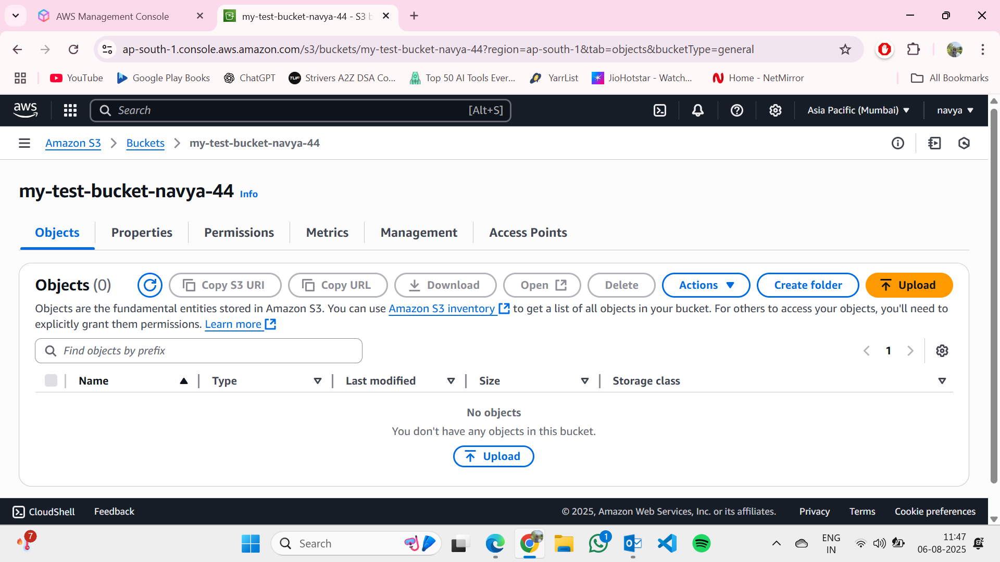
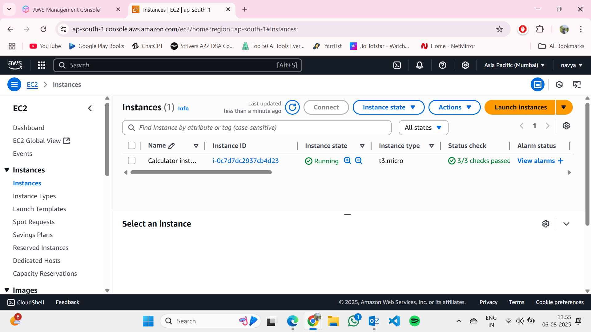
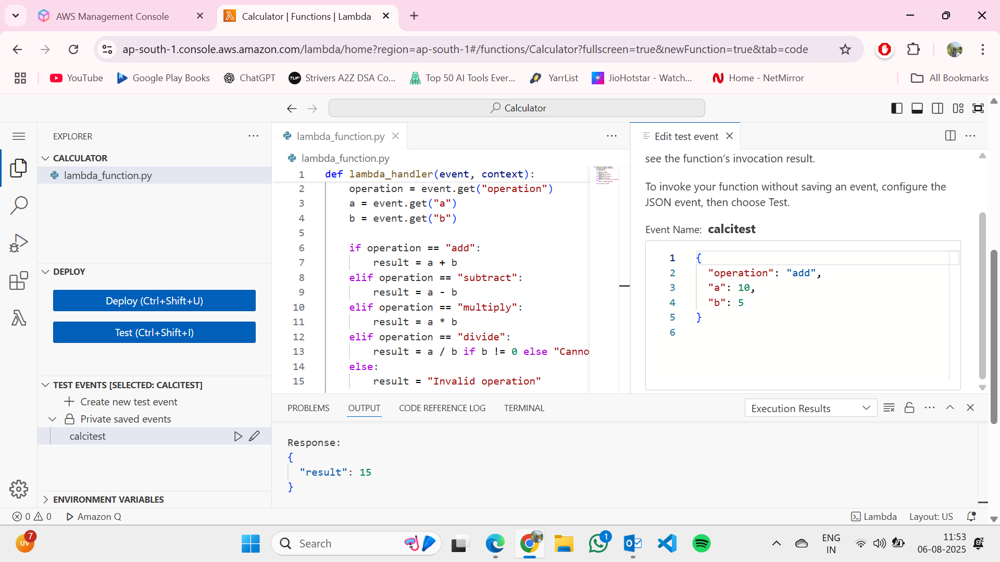
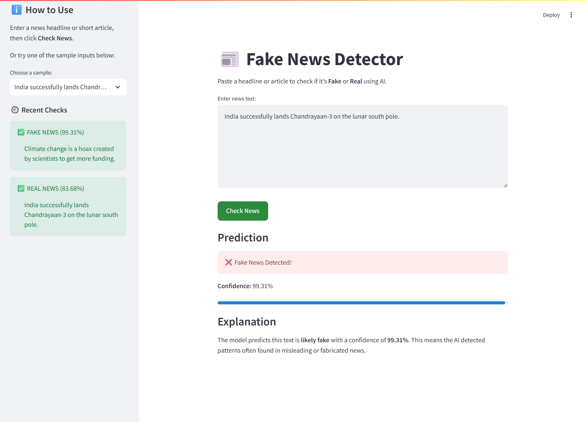

# Generative AI Assignments

This repository contains my Generative AI assignments completed during training.

## 📂 Quick Links  
- [Week 1](#-week-1)
- [Week 2](#-week-2)

 ## 📂 Week 1  

This week focused on **introductory AI projects** like a To-Do List app, AWS setup, and simple Groq-based tasks (rainbow explanation, poem generator, RetrievalQA, chunking).  

# To-Do List

[Folder Link: TODO](./Week1/TODO/)

## Original Requirement
Build a simple to-do list application.
## My Implementation
I created a **Streamlit-based To-Do List app** that allows users to:
- Add new tasks.
- Mark tasks as completed.
- Delete tasks.
- Filter tasks based on status (All, Pending, Completed).
- Assign priority levels to tasks (High, Medium, Low).

The tasks are stored in a `tasks.json` file so that they persist between sessions.

## Features
- **Task Management:** Add, complete, and delete tasks.
- **Prioritization:** Assign each task a High, Medium, or Low priority.
- **Filtering:** View all tasks, only pending tasks, or only completed tasks.
- **Progress Overview:** Displays counts of completed, pending, and total tasks.
- **Persistent Storage:** Saves tasks to a JSON file.


---

# AWS Setup and Calculator Lambda

[Folder Link: AWS](./Week1/AWS/)

## Overview
This project involves setting up AWS services including S3, EC2, and Lambda, and deploying a Python-based calculator function.

## Steps Completed

### 1. AWS Free Tier Account
- Created and configured an AWS Free Tier account.

### 2. S3 Bucket Creation
- Created an S3 bucket named **my-test-bucket-navya-44**.
- Verified successful creation and access through the AWS S3 Console.
- Bucket is ready to store and manage objects.

### 3. EC2 Instance Launch
- Launched an EC2 instance.
- **Instance Name:** Calculator instance.

### 4. AWS Lambda: Python Calculator Script
- Created a Lambda function named **Calculator**.
- Used **Python 3.13** runtime.
- Wrote and deployed a basic calculator function supporting:
  - Addition
  - Subtraction
  - Multiplication
  - Division
- Successfully tested the function with sample input.

## AWS Project Screenshots

### S3 Bucket


### EC2 Instance


### Lambda Function


## Notes
- All services were created and tested in the AWS Free Tier environment.
- The Lambda function can be extended to handle more operations as needed.

---

## Assignments of Session 3 and 4
1. [Task 1 – Rainbow Explanation (Groq AI)](#task-1--rainbow-explanation-groq-ai) 
2. [Task 2 – Poem Generator](#task-2--poem-generator)
3. [Task 3 – RetrievalQA: Company Policy Q&A System](#task-3--retrievalqa-company-policy-qa-system)
4. [Task 4 – Document Loader & Chunk Counter](#task-4--document-loader--chunk-counter)

---

## Task 1 – Rainbow Explanation (Groq AI)

[Folder Link: Rainbows](./Week1/Rainbows/)

### Original Requirement  
Write a Python script to send the prompt **"Explain how rainbows are formed"** using OpenAI’s GPT-3.5 Turbo or Hugging Face Transformers, and print the response.

### My Implementation  
I created a Python chatbot using **Groq AI’s LLaMA-3** model via the Groq API.  
The script:
- Accepts a prompt from the user (in this case, *"Explain how rainbows are formed"*).  
- Sends it to the selected LLaMA-3 model.
- Prints the AI-generated explanation to the interface.

### Additional Enhancements  
- Built a **Streamlit** web interface instead of a console script.  
- Added model selection (`llama3-8b-8192` or `llama3-70b-8192`).  
- Styled chat messages with user/AI avatars and preserved chat history in the session.
- 

---

## Task 2 – Poem Generator

[Folder Link: poem](./Week1/poem/)

### Original Requirement  
Use the Transformers library from Hugging Face to load a model and generate text from the prompt:  
*"Write a small poem about the ocean"*. Print the result.

### My Implementation  
I fulfilled the text-generation requirement using **Groq AI’s LLaMA-3** model to produce the poem.  
The app:
- Accepts a topic as input.
- Generates a 10-line poem about that topic.

### Additional Enhancements  
- Added **AI-generated artwork** for the poem using **Hugging Face’s Stable Diffusion**.  
- Designed a **polished, gradient-based Streamlit UI** with equal-height content cards.  
- Allowed any topic (not just “ocean”), making it reusable for more prompts.  
- Displayed the poem and artwork side-by-side for a complete creative output.


---

## Task 3 – RetrievalQA: Company Policy Q&A System

[Folder Link: rag_ui](./Week1/rag_ui/)

### Original Requirement  
Using RetrievalQA, create a pipeline that can answer the question:  
*"What is the refund policy?"* based on a sample company policy document.

### My Implementation  
I built a RetrievalQA system that:
- Loads the policy document.
- Uses embeddings to find relevant sections.
- Passes them to an LLM to generate the answer.

### Additional Enhancements  
- Allowed **multiple PDF/TXT uploads**, not just one document.  
- Built a **RAG pipeline** using:
  - `CohereEmbeddings` for vectorization.
  - `FAISS` for vector storage.
  - **Groq AI LLaMA-3** for answer generation.  
- Added answer style toggle (Concise/Detailed).  
- Displayed sources with page numbers and file names.  
- Included a **sidebar history** with quick re-run and download options for cited documents.


---

## Task 4 – Document Loader & Chunk Counter

[Folder Link: chunks](./Week1/chunks/)

### Original Requirement  
Load a `.txt` or `.pdf` file using LangChain’s `TextLoader` and split it using `RecursiveCharacterTextSplitter`. Print the total number of document chunks created.

### My Implementation  
I wrote a Python script that:
- Reads `.pdf` and `.txt` files from a `data` folder.
- Loads them with `PyPDFLoader` or `TextLoader`.
- Cleans whitespace before splitting.
- Splits into chunks of 1000 characters with an overlap of 100.
- Prints the total number of chunks created.

### Additional Enhancements  
- Supported **multiple files** at once instead of a single file.  
- Automatically finds all `.pdf` and `.txt` files in the `data` folder.  
- Made chunk size and overlap easily configurable in the code.


---
## 🍳 AI Recipe Generator(AWS Bedrock + Streamlit)

[Folder Link: AI Recipe Generator](./Week1/AWSBedrock/)

### Overview
An interactive **Streamlit web app** that uses **AWS Bedrock** with LLaMA 3 to generate creative and dietary-compliant recipes based on the ingredients you have.  

This app automatically filters or replaces ingredients to match dietary restrictions such as vegan, vegetarian, pescatarian, and gluten-free. You just list your ingredients, choose preferences, and let AI cook up something delicious.

---

##  Features

- **Dietary Restrictions Support**
  - Vegan, Vegetarian, Pescatarian, Gluten-Free, or No restriction
  - Automatic ingredient replacement or removal
-  **Customizable Recipe Output**
   - Choose number of recipes (1–5)
   - Select difficulty (Any, Easy, Medium, Hard)
   - Set servings count
-  **AI-Powered**
   - Uses AWS Bedrock with `meta.llama3-8b-instruct-v1:0` for recipe generation
-  **Beautiful UI**
   - Styled recipe cards with sections for ingredients, steps, and notes


## 📂 Week 2  

This week focused on **Prompt Engineering** (Session 1) and **Exploring Open Source LLMs with Local Setup** (Session 2).  

---

## Session 1: Prompt Engineering  

### 📝 Assignment 1: Zero-shot vs Few-shot Prompting  

[Folder Link: Assignment 1](./Week2/session1/assignment1/) 

**Objective**  
Understand the difference between zero-shot and few-shot prompting in LLMs.  

**Description**  
- **Zero-shot prompting:** Instruction given without examples.  
- **Few-shot prompting:** Instruction preceded by 2–3 examples to guide the model’s style.  
- Tested on multiple creative tasks (movie pitch generation).  
- Compared outputs for accuracy, style, and consistency.  

**Deliverables**  
- [`app.py`](./Week2/session1/assignment1/app.py) — Streamlit app to generate & compare outputs.  
- [Report (DOCX)](./Week2/session1/assignment1/Zero%20shot%20vs%20few%20shot.docx) — Includes prompts, outputs, and observations.  
- Screenshot of test runs.  


---

### 📝 Assignment 2: Role-based & Chain-of-Thought Prompting  

[Folder Link: Assignment 2](./Week2/session1/assignment2/)  

**Objective**  
Learn how role-based and chain-of-thought prompting improve the quality of LLM responses.  

**Description**  
- **Role-based prompting:** Assigned roles (e.g., *Tour Guide*, *Luxury Agent*, *Foodie*) to adapt response style.  
- **Chain-of-Thought prompting:** Instructed the model to think step by step, producing more structured reasoning.  
- Compared outputs across creative and reasoning-based tasks (e.g., travel itineraries).  

**Deliverables**  
- [`app.py`](./Week2/session1/assignment2/app.py) — Streamlit app to generate & compare outputs.  
- [Report (DOCX)](./Week2/session1/assignment2/role%20vs%20cot.docx) —  Includes prompts, outputs, and observations.  
- [Screenshots of outputs(pdf)](./Week2/session1/assignment2/role%20vs%20cot%20outputs.pdf) -for each prompt type.  

---

## Session 2: Open Source LLMs & Local Setup  

### 📝 Assignment 1: Hugging Face Model Exploration  
**Project:** Fake News Detector 

[Folder Link: Assignment 1](./Week2/session2/assignment1/)  

**Objective**  
Explore an open-source model from Hugging Face Hub and use it to perform a simple NLP task.  

**Description**  
- Set up a Python virtual environment and installed `transformers` and `torch`.  
- Selected the model **Pulk17/Fake-News-Detection** from Hugging Face Hub.  
- Built a **Streamlit web app** that classifies input news headlines or short articles as **Fake** or **Real**.  
- Added extra features like confidence scoring, low-confidence warnings, and a history of recent checks.  

**Features**  
- Input box or sample text options.  
- Prediction displayed as **Real** or **Fake** news.  
- Confidence percentage with a progress bar.  
- Warning for low-confidence predictions (< 60%).  
- Sidebar with history of last 5 checks.  

**Deliverables**  
- [`app.py`](./Week2/session2/assignment1/app.py) — Streamlit Fake News Detector app.  
- Screenshot(s) of working application. 



**How to Run**  
```bash
# 1. Create virtual environment
python -m venv venv
source venv/bin/activate   # On Windows: venv\Scripts\activate

# 2. Install dependencies
pip install -r requirements.txt

# 3. Run the Streamlit app
streamlit run app.py
```
---
### Assignment 2: Local LLM Installation and Testing

[Folder Link: Assignment 2](./Week2/session2/assignment2/)  

### Objective  
Install a local Large Language Model (LLM) using Ollama, run a simple test prompt, measure response time, and document troubleshooting steps.  

### Deliverables  
- [Local LLM Report (DOCX)](./Week2/session2/assignment2/Local-LLM.docx) — contains:  
  - Installation steps  
  - Sample prompt and output  
  - Response time measurement  
  - Troubleshooting notes  
  - Reflection on performance and installation experience  
  ---
## Session 3

### Task  
Build Python scripts for text generation and chat, error handling, streaming responses, and best practices.

[Folder Link: session 3](./Week2/session3/) 

### Overview  
An interactive multi-chat interface built with **Streamlit** and **Groq API**. This app allows users to create, manage, and chat across multiple conversations with streaming responses in a clean iMessage-like UI.

---

### 📌 Features
- **Text Generation & Chat**: Integrated Groq API for real-time AI chat.  
- **Error Handling**: Graceful error messages for API and network issues.  
- **Streaming Responses**: Tokens stream into the UI for a smooth experience.  
- **Multi-Chat Management**: Create, delete, and switch between multiple chats.  
- **Persistent History**: Conversations are saved in `chat_history.json`, restored on reload, and can be reopened.  
- **Customizable Settings**: Pick from multiple available Groq models, adjust creativity (temperature), and set max tokens.  
- **Polished UI**: Modern iMessage-like chat bubbles with avatars.  

---

### Screenshots
  
---  
  
