# Generative AI Assignments

This repository contains my Generative AI assignments completed during training.

## 📂 Quick Links  
- [Week 1](#-week-1)  
  - [Day 1: Calculator & To-Do List](#day-1--task-1-calculator--to-do-list)  
  - [Day 2: AWS S3, EC2 & Lambda Calculator](#day-2--task-1-aws-s3-ec2--lambda-calculator)  
  - [Day 3: Rainbow Response](#day-3--task-1-rainbow-response)  
  - [Day 3: Poem Generator](#day-3--task-2-poem-generator)  
  - [Day 4: Text Splitter](#day-4--task-1-text-splitter)  
  - [Day 4: RetrievalQA](#day-4--task-2-retrievalqa)  
  - [Day 5: Bedrock Recipe Generator](#day-5--task-1-bedrock-recipe-generator)  

- [Week 2](#-week-2)  
  - [Day 2: ZeroShot vs FewShot](#day-2--task-1-zeroshot-vs-fewshot)  
  - [Day 2: Role-Based CoT](#day-2--task-2-role-based-cot)  
  - [Day 3: Fake News Detector](#day-3--task-1-fake-news-detector)  
  - [Day 4: Local LLM Poem](#day-4--task-1-local-llm-poem)  
  - [Day 4: Hands-On Text Generation & Chat](#day-4--task-2-hands-on-text-generation--chat)  

- [Week 3](#-week-3)  
  - [Day 1: Loan Calculator App](#day-1--task-1-loan-calculator-app)  
  - [Day 1: ChatApp (Groq + OpenAI)](#day-1--task-2-chatapp-groq--openai)  
  - [Day 2: MultiAgent RAG System](#day-2--task-1-multiagent-rag-system)  

---

## 📂 Week 1  

This week covered Python basics, AWS setup, and introductory Generative AI (rainbow explanation, poem generation, RAG pipeline, and Bedrock deployment).  

---

### Day 1 – Task 1: Calculator & To-Do List  
[Folder Link](./Week1/Day1_Basics_of_Python/Task1_Calculator_ToDoList/)

A **Streamlit To-Do List app** with persistent JSON storage.  

**Key Features & Enhancements**  
- Add, complete, delete, and filter tasks  
- Priority levels (High/Medium/Low)  
- Progress summary (pending vs completed)  
- Tasks saved in JSON to persist across sessions  

---

### Day 2 – Task 1: AWS S3, EC2 & Lambda Calculator  
[Folder Link](./Week1/Day2_Basics_of_Cloud/Task1_AWS_S3_Account_Setup/)

Configured **AWS S3, EC2, and Lambda** to deploy a Python calculator.  

**Key Features & Enhancements**  
- Created S3 bucket for storage  
- Launched EC2 instance for compute  
- Lambda calculator function (Add/Subtract/Multiply/Divide)  
- Tested end-to-end successfully on AWS Free Tier  

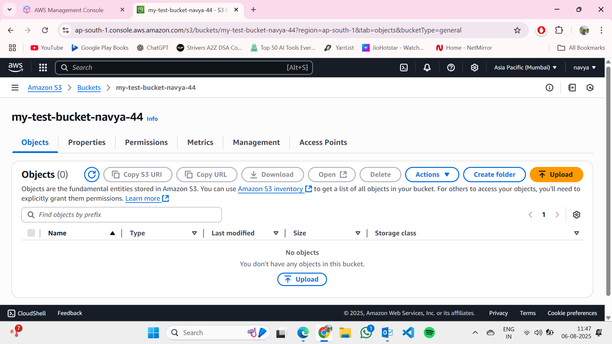  
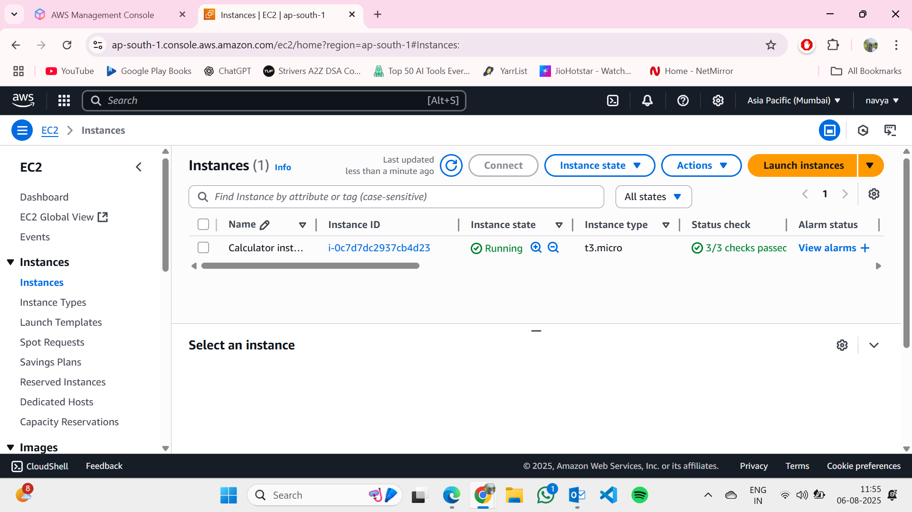  
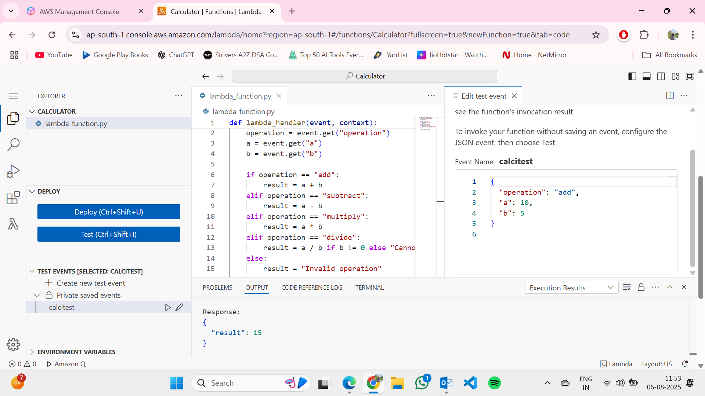

---

### Day 3 – Task 1: Rainbow Response  
[Folder Link](./Week1/Day3_Basics_of_GenAI/Task1_Rainbow_Response_HF/)

Prompted **Groq LLaMA-3** to explain rainbow formation.  

**Key Features & Enhancements**  
- Streamlit app (instead of console script)  
- Model selection (LLaMA 8B or 70B)  
- Chat-style UI with avatars & preserved history  

---

### Day 3 – Task 2: Poem Generator  
[Folder Link](./Week1/Day3_Basics_of_GenAI/Task2_Ocean_Poem_HF/)

Generates **AI poems** on any topic.  

**Key Features & Enhancements**  
- Topic-based poem generation (not limited to “ocean”)  
- Added **AI artwork** using Hugging Face Stable Diffusion  
- Stylish Streamlit UI with side-by-side poem + artwork  
- Reusable for multiple creative prompts  

---

### Day 4 – Task 1: Text Splitter  
[Folder Link](./Week1/Day4_Basics_of_RAG/Task1_TextSplitter_LangChain/)

Chunked `.pdf`/`.txt` files using LangChain.  

**Key Features & Enhancements**  
- Supports both PDF and TXT formats  
- RecursiveCharacterTextSplitter (configurable size & overlap)  
- Handles multiple files in one run  
- Automatic whitespace cleaning before chunking  

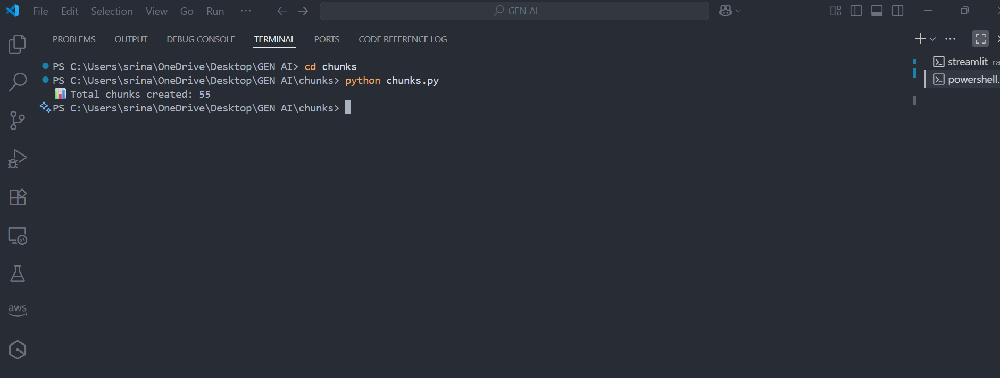

---

### Day 4 – Task 2: RetrievalQA  
[Folder Link](./Week1/Day4_Basics_of_RAG/Task2_RetrievalQA/)

Built a **RAG pipeline** for document-based Q&A.  

**Key Features & Enhancements**  
- Multi-file PDF/TXT upload  
- FAISS vector DB + Cohere embeddings  
- Groq LLaMA-3 for Q&A generation  
- Answer style toggle (Concise/Detailed)  
- Source citation with page numbers & file names  
- Sidebar history with quick re-run & downloads  

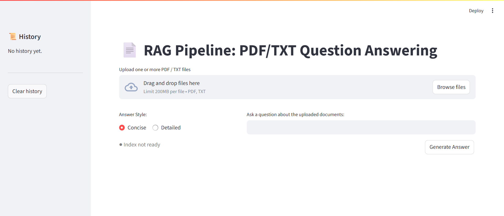  
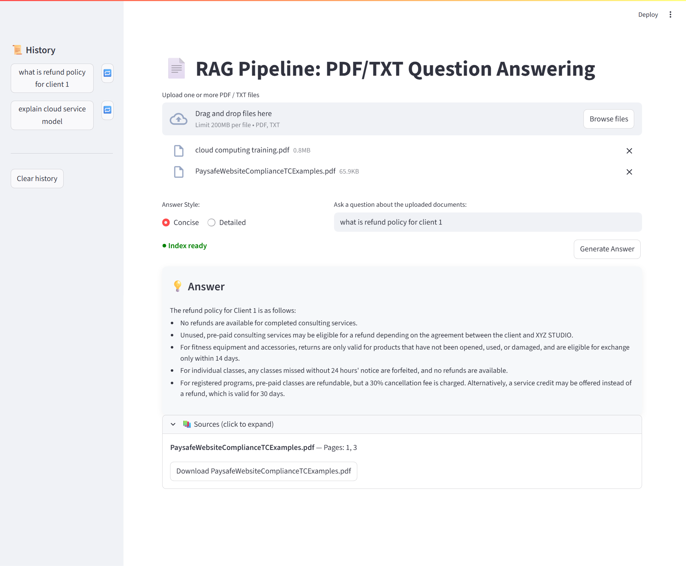

---

### Day 5 – Task 1: Bedrock Recipe Generator  
[Folder Link](./Week1/Day5_Amazon_Bedrock/Task1_Bedrock_Project_Deployment/)

A **Streamlit app** powered by AWS Bedrock (LLaMA-3) to generate custom recipes.  

**Key Features & Enhancements**  
- Dietary filters: Vegan, Vegetarian, Pescatarian, Gluten-free  
- Auto ingredient replacement/removal  
- Customizable servings, difficulty, and recipe count  
- Stylish recipe cards with ingredients, steps, and notes  

## 📂 Week 2  

This week focused on **Prompt Engineering** and **Open Source LLMs** (both cloud and local setups).  

---

### Day 2 – Task 1: ZeroShot vs FewShot  
[Folder Link](./Week2/Day2_Prompt_Engineering/Task1_ZeroShot_vs_FewShot/)  

Compared **zero-shot vs few-shot prompting** on creative tasks like movie pitch generation.  

**Key Features & Enhancements**  
- Streamlit app to generate & compare outputs  
- Showed how few-shot improves style consistency  
- Report with side-by-side outputs and analysis  

**Deliverables**  
- [`app.py`](./Week2/Day2_Prompt_Engineering/Task1_ZeroShot_vs_FewShot/app.py)  
- [Report (DOCX)](./Week2/Day2_Prompt_Engineering/Task1_ZeroShot_vs_FewShot/Zero%20shot%20vs%20few%20shot.docx)  

---

### Day 2 – Task 2: Role-Based CoT  
[Folder Link](./Week2/Day2_Prompt_Engineering/Task2_Role_Based_CoT/)  

Explored **role-based prompting** and **chain-of-thought reasoning**.  

**Key Features & Enhancements**  
- Role-based outputs (Tour Guide, Foodie, Luxury Agent, etc.)  
- Chain-of-thought for structured reasoning  
- Streamlit app with prompt comparisons  
- Outputs documented for review  

**Deliverables**  
- [`app.py`](./Week2/Day2_Prompt_Engineering/Task2_Role_Based_CoT/app.py)  
- [Report (DOCX)](./Week2/Day2_Prompt_Engineering/Task2_Role_Based_CoT/role%20vs%20cot.docx)  
- [Screenshots (PDF)](./Week2/Day2_Prompt_Engineering/Task2_Role_Based_CoT/role%20vs%20cot%20outputs.pdf)  

---

### Day 3 – Task 1: Fake News Detector  
[Folder Link](./Week2/Day3_Running_OpenSource_LLM/Task1_TextClassification_Summarization/)  

A **Streamlit app** using Hugging Face model `Pulk17/Fake-News-Detection` to classify text as Real or Fake.  

**Key Features & Enhancements**  
- Confidence scoring with progress bar  
- Low-confidence warnings (<60%)  
- Sidebar with last 5 checks  
- User-friendly text box with sample inputs  

**Deliverables**  
- [`app.py`](./Week2/Day3_Running_OpenSource_LLM/Task1_TextClassification_Summarization/app.py)  
- Screenshot of app output  

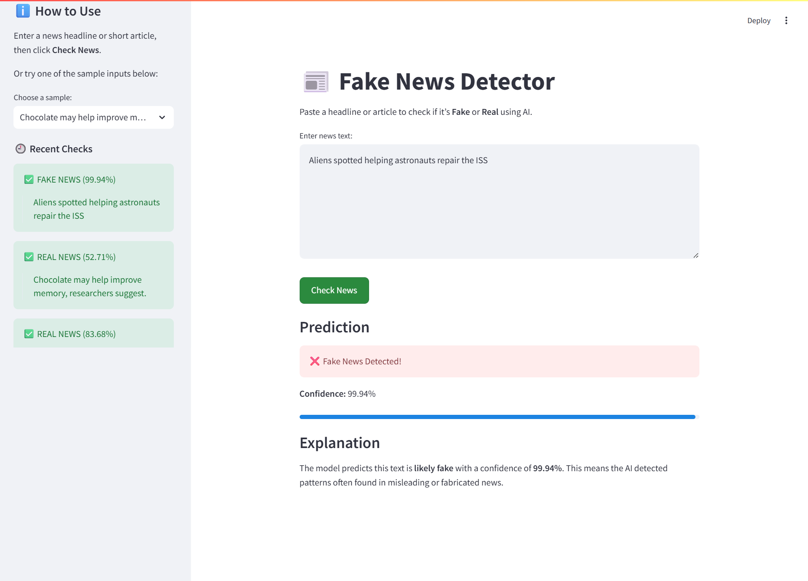

---

### Day 4 – Task 1: Local LLM Poem  
[Folder Link](./Week2/Day4_Calling_LLM_Python/Task1_AI_Poem_LocalLLMWeek3/)  

Installed and tested a **local LLM with Ollama**.  

**Highlights**  
- Setup instructions & troubleshooting  
- Generated a sample poem and measured response time  
- Reflections on performance documented  

**Deliverables**  
- [Report (DOCX)](./Week2/Day4_Calling_LLM_Python/Task1_AI_Poem_LocalLLMWeek3/local%20llm%20ollama.docx)  

---

### Day 4 – Task 2: Hands-On Text Generation & Chat  
[Folder Link](./Week2/Day4_Calling_LLM_Python/Hands_On_Text_Genaration_and_Chat/)  

A **Streamlit app** built with **Groq API** for text generation and chat.  

**Key Features & Enhancements**  
- Two modes: Text Generation & Multi-turn Chat  
- Streaming responses with error handling  
- Multi-chat management with persistent history  
- Customizable model, temperature, and tokens  
- Polished UI with avatars & iMessage-style bubbles  

**Deliverables**  
- [`app.py`](./Week2/Day4_Calling_LLM_Python/Hands_On_Text_Genaration_and_Chat/app.py)  
- Screenshots of both modes  

**Screenshots**  
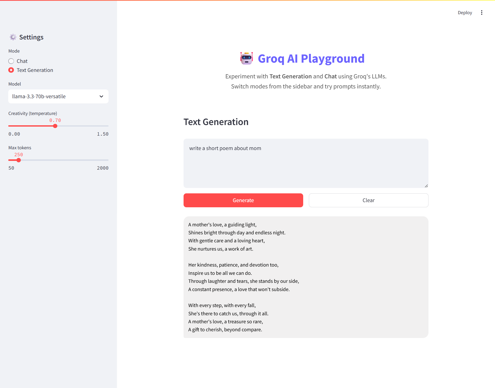  
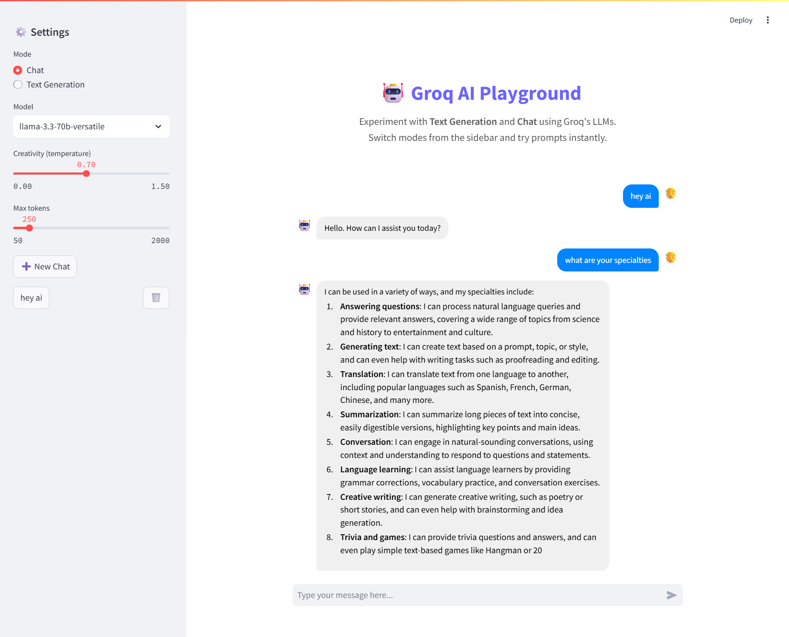

---
## 📂 Week 3  

This week focused on **Streamlit Basics** and **AI Agent Basics**.  

---

### Day 1 – Task 1: Loan Calculator App  
[Folder Link](./Week3/Day1_Streamlit_Basics/Task1_Loan_Calculator_App/) | [Live Demo](https://easy-loan-calculator.streamlit.app/)  

An interactive **Streamlit app** to calculate EMIs, generate amortization schedules, compare loan scenarios, and track repayment milestones.  

**Key Features & Enhancements**  
- EMI calculation with detailed amortization table  
- Compare two loan scenarios side by side  
- Loan insights: principal vs interest, milestones (50% repaid, balance ≤ 25%)  
- Visuals: pie chart for repayment breakdown  
- Export results as CSV  
- Clean, responsive UI with sidebar inputs  

**Screenshots**  
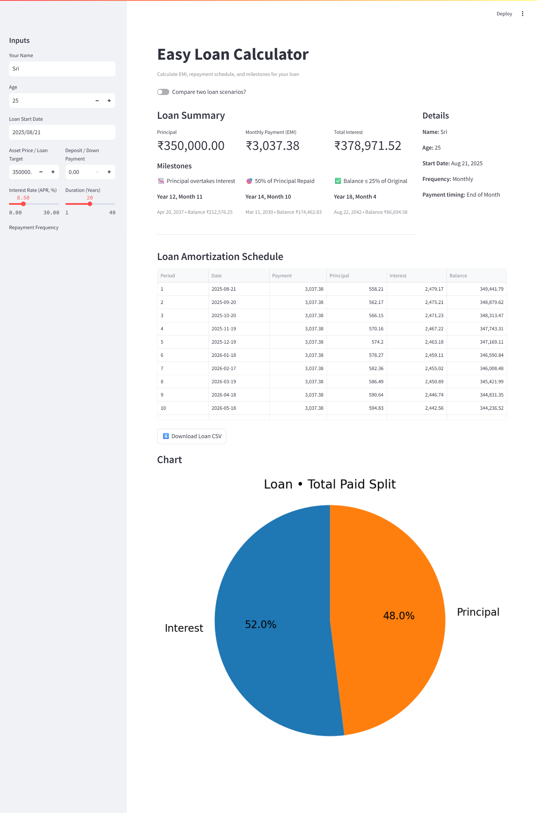  
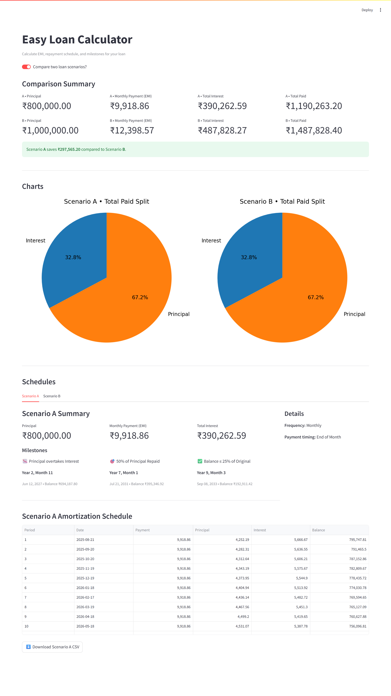  

More screenshots in the [output-images folder](./Week3/Day1_Streamlit_Basics/Task1_Loan_Calculator_App/output-images).  

---

### Day 1 – Task 2: ChatApp (Groq + OpenAI)  
[Folder Link](./Week3/Day1_Streamlit_Basics/Task2_ChatApp_Groq_OpenAI/) | [Live Demo](https://oracle-chat-app.streamlit.app/)  

A mystical **chat app** that blends **LLM prophecies** with **Tarot card draws**, styled with a starry dark theme.  

**Key Features & Enhancements**  
- Chat UI with typing effect (“Oracle whispers”)  
- Tarot draws: single card or 3-card spread (Past / Present / Future)  
- Reversals with visual cues & badges  
- Sidebar: sample questions, mini archive, clear conversation  
- Oracle weaves card meanings into responses  
- External `styles.css` for glowing starfield theme  

**Screenshot**  
  

---

### Day 2 – Task 1: MultiAgent RAG System  
[Folder Link](./Week3/Day2_AI_Agent_Basics/Task1_MultiAgent_RAG_System/) | [Live Demo](https://multiagent-rag.streamlit.app/)  

A **multi-agent RAG app** built with Streamlit + LangChain + Gemini AI to answer salary and insurance queries.  

**Key Features & Enhancements**  
- Salary Q&A: CTC breakdown, deductions, in-hand calculation  
- Insurance Q&A: premiums, claims, co-pay, coverage  
- Multi-agent routing (queries sent to right specialist)  
- Default context or upload your own docs  
- Download chats as text  
- Follow-up suggestions for quick queries  
- Debug mode: view retrieved snippets  

**Screenshot**  
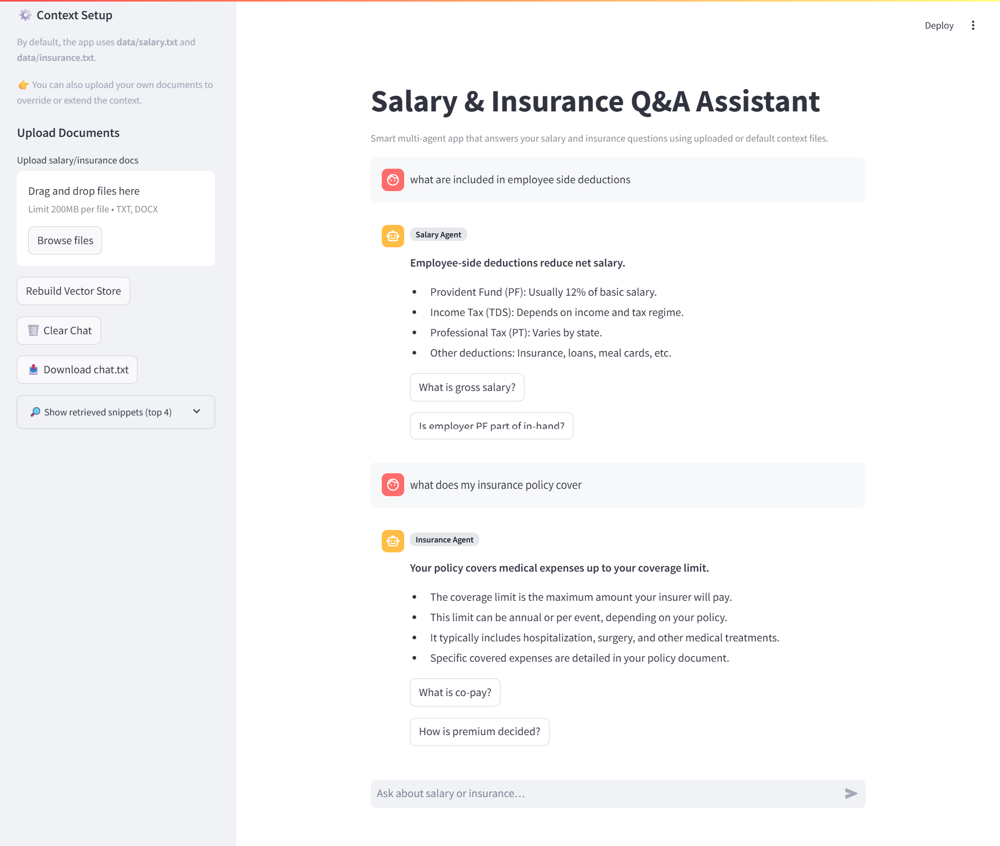  
